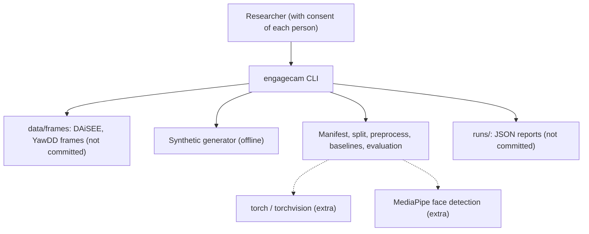
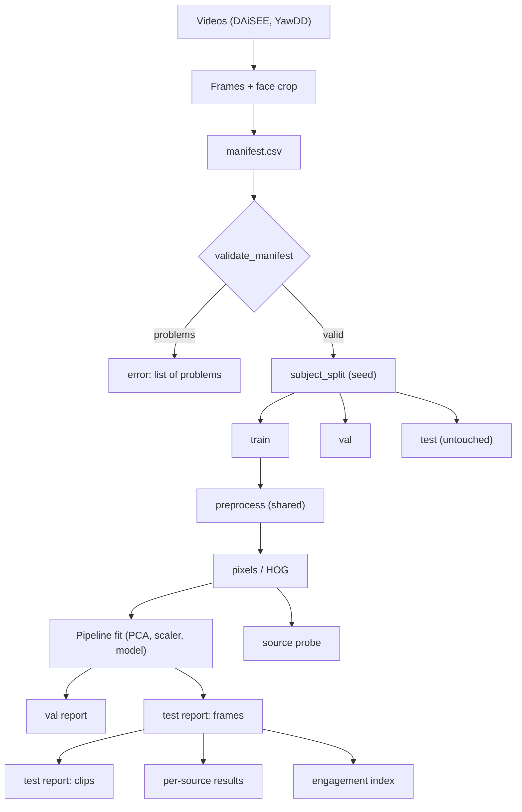

<div align="center">

# engagecam — A Subject-Disjoint Benchmark for Engagement States in Face Video

**engagecam is a research benchmark for teams who study engagement in online learning sessions. It takes face frames with subject and clip ids through these steps to honest state scores and a session engagement index:**

`build manifest` → `split by subject` → `preprocess (one function)` → `fit on train only` → `score the untouched test` → `aggregate clips` → `probe the source`.


**[Summary](#1-summary)** ·
**[Workflow](#4-the-end-to-end-workflow)** ·
**[Run it](#14-how-to-run-engagecam)** ·
**[Configuration](#144-environment-variables)** ·
**[Known problems](#17-known-problems)** ·
**[Glossary](#19-glossary)**

</div>

> [!NOTE]
> This README uses ASD-STE100 Simplified Technical English. The writing rules and the project
> vocabulary are in [`docs/ste-style-guide.md`](docs/ste-style-guide.md). Each term in the
> [Glossary](#19-glossary) has only one meaning.

> [!WARNING]
> Do not use engagecam to watch, grade, rank or discipline a person. Use it only for research, with the informed consent of each person on camera.
> Facial expressions do not prove attention. The models can learn the camera, the room or the skin tone instead of the state.
> Check each result by subject group and by source.

---

engagecam classifies face frames into 7 engagement and affect states and gives an engagement index for a session.
Its main idea is honest measurement: each person is in one split only, and the test split is never used to fit anything.
Training and inference use one preprocessing function, and a source probe shows when the model can identify the data set instead of the state.

This README is the **one location that explains all of engagecam**. It gives these topics:

- the general design
- each component and its procedure, step by step
- the decision rules
- the data map
- the runbook
- the validation results and the known problems

| If you are… | Read |
|---|---|
| A manager or reviewer | [1](#1-summary), [3](#3-design-rules), [4](#4-the-end-to-end-workflow), [16](#16-validation-results), [18](#18-key-points) |
| A developer who joins the project | All sections, in sequence. Keep [14](#14-how-to-run-engagecam) and [17](#17-known-problems) open while you work |
| An operator who runs engagecam | [14](#14-how-to-run-engagecam), then the section for the component that you use |

---

## Table of contents

1. 🧭 [Summary](#1-summary)
2. 🏗️ [How engagecam is built](#2-how-engagecam-is-built)
   - 2.1 [Components](#21-components)
   - 2.2 [System context](#22-system-context)
   - 2.3 [Repository layout](#23-repository-layout)
3. 🛡️ [Design rules](#3-design-rules)
4. 🔄 [The end-to-end workflow](#4-the-end-to-end-workflow)
   - 4.1 [Full flow](#41-full-flow)
   - 4.2 [The life cycle of one frame](#42-the-life-cycle-of-one-frame)
5. 🔵 [The states and the source rules](#5-the-states-and-the-source-rules)
6. 🟢 [The manifest](#6-the-manifest)
7. 🟣 [The subject-disjoint split](#7-the-subject-disjoint-split)
8. ✂️ [Face crop and preprocessing](#8-face-crop-and-preprocessing)
9. 🧮 [The baselines](#9-the-baselines)
10. 🧠 [The deep models](#10-the-deep-models)
11. 📏 [Evaluation, clips and the source probe](#11-evaluation-clips-and-the-source-probe)
12. 📈 [The engagement index](#12-the-engagement-index)
13. 🗂️ [Data and file map](#13-data-and-file-map)
14. ▶️ [How to run engagecam](#14-how-to-run-engagecam)
    - 14.1 [Prerequisites](#141-prerequisites) · 14.2 [Installation](#142-installation) · 14.3 [Run engagecam](#143-run-engagecam) · 14.4 [Environment variables](#144-environment-variables)
15. 🧩 [How to extend engagecam](#15-how-to-extend-engagecam)
16. ✅ [Validation results](#16-validation-results)
17. ⚠️ [Known problems](#17-known-problems)
18. 📌 [Key points](#18-key-points)
19. 📖 [Glossary](#19-glossary)
20. 📄 [License](#20-license)

---

## 1. Summary

**The problem.** A research team wants to know how well a model finds engagement states in video of online sessions. These questions are difficult:

- How do you stop frames of one person from appearing in train and test?
- How do you keep oversampling and dimension reduction away from the test rows?
- How do you make sure that inference sees the same input as training?
- Does the model learn the state, or only the data set that the frame comes from?

engagecam gives each of these questions its own component. Each component has tests that prove its rule.

| Item | Value |
|---|---|
| Input | A frame manifest (`path, subject_id, clip_id, source, state, frame`), or SYNTHETIC frames |
| Output | Validation and test reports (frame and clip level), per-source results, a source probe, an engagement summary, sample predictions from the test split |
| Components | **11** core modules: states, manifest, splits, faces, preprocess, synthetic, features, baselines, evaluate, engagement, pipeline, plus `cli` and `deep` (torch) |
| Models | `pca_logreg`, `hog_logreg`, `hog_mlp` (core), `tiny_cnn`, `efficientnet_b0` (extra `torch`) |
| Offline mode | All baselines, the demo and the core tests. No download, no GPU |
| Safety | Subject- and clip-disjoint splits, train-only fitting, one preprocessing function, a consent notice in each CLI output |
| Tests | **27** pass with torch. In CI, **26** pass and **1** skips |


---

## 2. How engagecam is built

### 2.1 Components

| Component | Module | Purpose |
|---|---|---|
| States | `src/engagecam/states.py` | The 7 states, aliases, DAiSEE and YawDD rules, engagement weights |
| Manifest | `src/engagecam/manifest.py` | Build and validate the frame manifest |
| Splits | `src/engagecam/splits.py` | Subject-disjoint split, frame split (for comparison), leak check |
| Face crop | `src/engagecam/faces.py` | Centre crop (default) and MediaPipe detector (extra) |
| Preprocessing | `src/engagecam/preprocess.py` | One function for training and inference, input specs, BGR conversion |
| Synthetic data | `src/engagecam/synthetic.py` | Drawn face-like frames with subjects, clips and two sources |
| Features | `src/engagecam/features.py` | Image sources, gray pixels and HOG features |
| Baselines | `src/engagecam/baselines.py` | Pipelines with PCA and scalers inside, train-only oversampling |
| Evaluation | `src/engagecam/evaluate.py` | Metrics, clip aggregation, per-source results, Cramér's V, source probe |
| Engagement index | `src/engagecam/engagement.py` | Weighted state probabilities, smoothing, session summary |
| Pipeline | `src/engagecam/pipeline.py` | One experiment from split to report |
| Deep models | `src/engagecam/deep.py` | TinyCNN and EfficientNet-B0 training (torch) |
| CLI | `src/engagecam/cli.py` | The `engagecam` command with 7 subcommands |

### 2.2 System context



### 2.3 Repository layout

```
engagecam/
├── .github/workflows/ci.yml     # CI: Python 3.11, pip install -e ".[dev]", pytest -q
├── .env.example                 # the 3 environment variable names, no values
├── pyproject.toml               # core deps, extras torch, faces, dev, engagecam script
├── data/README.md               # sources, terms, state rules, frame layout
├── docs/ste-style-guide.md      # writing rules and project vocabulary
├── src/engagecam/
│   ├── states.py  manifest.py  splits.py
│   ├── faces.py  preprocess.py  synthetic.py  features.py
│   ├── baselines.py  evaluate.py  engagement.py  pipeline.py
│   ├── deep.py                  # torch only, imported on demand
│   └── cli.py
└── tests/                       # 27 tests, synthetic data only
```

---

## 3. Design rules

### 3.1 One person, one split
`subject_split` uses `StratifiedGroupKFold` with `subject_id` as the group. `assert_disjoint` raises `SplitLeakError` if a subject or a clip is in two splits.

### 3.2 Fit on the training split only
PCA and the scalers are pipeline steps, so `fit` sees only training rows. Oversampling runs after the split, on training rows only. No step uses the validation or the test rows to fit.

### 3.3 The test split is scored, and only once
Each experiment reports the untouched test split, at frame level and at clip level. The sample predictions for a visual check come from the test split only.

### 3.4 One preprocessing function
`preprocess` crops, resizes and scales each frame for training and for inference. Files are read with Pillow as RGB. `from_bgr` changes an OpenCV array to RGB first.

### 3.5 Each backbone gets its own input
`InputSpec` fixes the size and the scaling of each model. Section 8 gives the values for each backbone.

### 3.6 The source confound is measured
`state_source_association` gives Cramér's V between state and source. `source_probe` trains a classifier to find the source from the model features on unseen subjects, and reports the gain over the majority rate.

### 3.7 Problems of the earlier prototype and their fixes

| # | Problem in the earlier prototype | Fix in engagecam | Test |
|---|---|---|---|
| 1 | SMOTE before the split | Oversampling after the split, training rows only | `test_oversampling_touches_training_rows_only` |
| 2 | SVD fitted on all data | PCA inside the pipeline | `test_pca_is_fitted_inside_the_pipeline` |
| 3 | Frame-level split of video data | Subject- and clip-disjoint split and a leak check | `test_subject_split_is_disjoint`, `test_frame_split_leaks_and_is_detected` |
| 4 | The test set was never scored | Each run scores the untouched test split | `test_run_scores_the_untouched_test_split` |
| 5 | A CNN on SVD coefficients as an "image" | PCA and HOG with linear or MLP models, CNNs on real pixels only | `test_full_proba_has_seven_columns` |
| 6 | BGR at inference, RGB at training | One `preprocess`, Pillow RGB, `from_bgr` | `test_preprocess_parity_between_file_and_bgr_array` |
| 7 | Input size and scaling did not match the backbone | `InputSpec` for each model | `test_specs_match_the_backbones` |
| 8 | Visual checks on training images | Samples from the test split only | `test_run_scores_the_untouched_test_split` |
| 9 | Two data layouts, Colab paths, a large artefact | One manifest, relative paths, no artefact in Git | `test_cli_round_trip` |
| 10 | Mixed sources and labels, faces, no consent note | Explicit state rules, source probe, Cramér's V, consent notice | `test_daisee_rule`, `test_source_probe_finds_a_source_shortcut` |

---

## 4. The end-to-end workflow

### 4.1 Full flow



### 4.2 The life cycle of one frame

1. The manifest gives the path, the subject, the clip, the source and the state of the frame.
2. The split puts the subject of the frame in `train`, `val` or `test`.
3. `preprocess` reads the frame as RGB, crops the face, resizes and scales it with the input spec.
4. The baseline changes the result into gray pixels or HOG features.
5. A pipeline fitted on the training frames gives 7 state probabilities.
6. The clip report averages the probabilities of all frames of the clip.
7. The engagement index multiplies the probabilities by the state weights.

---

## 5. The states and the source rules

**Purpose.** Give one state order and one written rule for each source.

| Index | State | Engagement weight |
|---|---|---|
| 0 | `active` | 0.8 |
| 1 | `boredom` | 0.2 |
| 2 | `confusion` | 0.5 |
| 3 | `engagement` | 1.0 |
| 4 | `frustration` | 0.3 |
| 5 | `sleep` | 0.0 |
| 6 | `yawn` | 0.1 |

| Source | Rule |
|---|---|
| DAiSEE (levels 0–3) | The strongest of boredom, confusion and frustration with level 2 or more (ties in that order). Else `engagement` if its level is 2 or more. Else `active` |
| YawDD | `normal` and `talking` → `active`. `yawning` → `yawn` |

**Rules**

- Aliases such as `engaged`, `yawning` and `asleep` change to the state names. An unknown name raises `UnknownState`.
- A DAiSEE level outside 0–3 raises `ValueError`.

---

## 6. The manifest

**Purpose.** Give one data layout for all steps.

**Procedure**

1. Save each face frame as `<root>/<source>/<state>/<subject>__<clip>__<frame>.jpg`.
2. Run `engagecam manifest <root>`. A file name that does not follow the pattern stops the scan.
3. `validate_manifest` checks the columns, the missing values, the states and the duplicate paths.
4. It also checks that each clip belongs to one subject.

---

## 7. The subject-disjoint split

**Purpose.** Measure the model on persons that it did not see.

**Procedure**

1. Take the test part (20 %) with `StratifiedGroupKFold` by `subject_id`, stratified by state.
2. Take the validation part (15 % of all frames) from the rest in the same way.
3. Check that no subject and no clip is in two parts.

**Rules**

- `frame_split` exists only to measure the leakage. The CLI uses it only with `train --split-mode frame`.

---

## 8. Face crop and preprocessing

**Purpose.** Give each model the same input at training and at inference.

| Input spec | Size | Scaling | Channels |
|---|---|---|---|
| `baseline` | 64 | 0–1 | gray |
| `tiny_cnn` | 64 | ImageNet mean and std | RGB, channel first |
| `efficientnet_b0` | 224 | ImageNet mean and std | RGB, channel first |
| `keras_efficientnet_b0` | 224 | 0–255 (the model rescales) | RGB, channel first |

**Procedure**

1. Read the file with Pillow and change it to RGB. If the caller has an OpenCV array, apply `from_bgr`.
2. Crop the face. The default `CenterCropDetector` keeps the centre 80 %. `MediaPipeDetector` finds the face and adds a 25 % margin.
3. Resize to the spec size (bilinear).
4. Scale the values with the spec rule.

---

## 9. The baselines

**Purpose.** Give honest, fast reference models.

| Name | Features | Pipeline |
|---|---|---|
| `pca_logreg` | Gray pixels (4,096 values) | `StandardScaler` → `PCA(64)` → `LogisticRegression(class_weight="balanced")` |
| `hog_logreg` | HOG, 8 × 8 cells, 9 bins (576 values) | `StandardScaler` → `LogisticRegression(C=0.5, class_weight="balanced")` |
| `hog_mlp` | HOG | `StandardScaler` → `MLPClassifier(128, early stopping)` |

**Rules**

- `--oversample` copies training frames of rare states until each state has the majority count. It never makes new frames and never touches validation or test.
- `full_proba` always gives 7 columns in the state order.

---

## 10. The deep models

**Purpose.** Give CNN models with the correct input (`pip install engagecam[torch]`).

**Procedure**

1. `FrameDataset` calls `preprocess` with the input spec of the model. Training frames get a seeded horizontal flip.
2. The loss is cross-entropy with class weights from the training split.
3. After each epoch, the validation balanced accuracy is measured. A new best saves `best.pt`.
4. After the last epoch, `best.pt` is loaded again and the test split is scored.

| Model | Weights | Input spec |
|---|---|---|
| `tiny_cnn` | Random init | `tiny_cnn` |
| `efficientnet_b0` | torchvision `IMAGENET1K_V1` | `efficientnet_b0` |

---

## 11. Evaluation, clips and the source probe

| Metric | Level | Note |
|---|---|---|
| Balanced accuracy | Frame, clip, source | Headline metric |
| Macro F1 | Frame, clip | Over the states in the true labels |
| Precision, recall, F1 for each state | Frame | With support |
| Cohen's kappa, log-loss, ECE (15 bins), one-vs-rest AUC | Frame | Probabilities from all 7 columns |
| Clip report | Clip | Mean of the frame probabilities of each clip |
| Cramér's V | Manifest | Association between state and source |
| Source probe | Test subjects | Accuracy of a source classifier on the model features, minus the majority rate |

**Rules**

- A source probe lift near 0 means that the features do not show the source. A large lift is a warning: the model can use the source as a shortcut.
- The confusion matrix labels come from `states.STATES`.

---

## 12. The engagement index

**Purpose.** Give an aggregate signal for a session.

**Procedure**

1. For each frame, calculate the sum of P(state) × weight (section 5). The result is from 0 to 1.
2. Smooth the frame values with an exponential moving average (alpha 0.3).
3. Report the mean index, the last smoothed value and the share of frames below 0.4.

**Rules**

- The weights are a design choice, not a measured fact. Change them in `ENGAGEMENT_WEIGHTS`.
- Use the index for a group or a session, never for a decision about one person.

---

## 13. Data and file map

| Path | Committed? | Contents |
|---|---|---|
| `data/README.md` | Yes | Sources, terms, state rules, frame layout |
| `data/frames/`, `data/manifest.csv`, `data/split.csv` | No (git ignores them) | Real frames and their manifest |
| `data/synthetic/` | No (git ignores it) | Output of `engagecam synth` |
| `runs/*.json`, `runs/<model>/seed<k>/best.pt` | No (git ignores them) | Reports and checkpoints |
| `.env.example` | Yes | 3 variable names, no values |

---

## 14. How to run engagecam

### 14.1 Prerequisites

| Need | For |
|---|---|
| Python 3.11+ | All components |
| `numpy`, `pandas`, `scikit-learn`, `scipy`, `pillow` | The core (installed with the package) |
| Extra `torch` | `tiny_cnn`, `efficientnet_b0` |
| Extra `faces` (`mediapipe`) | Face detection before the crop |
| Access to DAiSEE and YawDD | Real data (see [`data/README.md`](data/README.md)) |

### 14.2 Installation

```bash
git clone https://github.com/KrishnaAnnavaram/engagecam.git
cd engagecam
python -m venv .venv
. .venv/bin/activate            # Windows: .venv\Scripts\activate
pip install -e ".[dev]"
pip install -e ".[torch,faces]" # optional
```

### 14.3 Run engagecam

Offline:

```bash
engagecam demo
engagecam synth --out data/synthetic
engagecam validate data/synthetic/manifest.csv
engagecam train data/synthetic/manifest.csv --model pca_logreg --seeds 0,1,2
engagecam train data/synthetic/manifest.csv --model pca_logreg --split-mode frame   # leakage comparison only
```

With real frames:

```bash
engagecam manifest data/frames --out data/manifest.csv
engagecam validate data/manifest.csv
engagecam split data/manifest.csv --out data/split.csv
engagecam train data/manifest.csv --model hog_logreg --oversample --seeds 0,1,2
engagecam infer data/manifest.csv path/to/frame.jpg
```

### 14.4 Environment variables

| Variable | Used by | Meaning |
|---|---|---|
| `ENGAGECAM_SEED` | `split`, `infer` | Default seed. Default 42 |
| `ENGAGECAM_DATA_DIR` | `synth` | Data folder. `synth` writes to `<folder>/synthetic` when `--out` is not given. Default `data` |
| `ENGAGECAM_OUTPUT_DIR` | `train` | Report folder when `--out` is not given. Default `runs` |

engagecam uses no credentials. Keep local settings in `.env`. Git ignores this file.

---

## 15. How to extend engagecam

| You want to… | Do this | Code change? |
|---|---|---|
| Add a source | Write its frames in the manifest layout and add a state rule to `states.py` | Small |
| Add a backbone | Add an `InputSpec` and a branch in `deep.build_model` | Small |
| Use a real face detector | Install the `faces` extra and pass `MediaPipeDetector()` to `preprocess` | Small |
| Change the engagement weights | Edit `ENGAGEMENT_WEIGHTS` | Small |
| Add a fairness slice (for example skin tone) | Add a column to the manifest and group the test report by it | Small |

Planned milestones (not built):

- **M4:** a temporal model over the frames of a clip (GRU).
- **M5:** fairness slices by subject group, with consent-based annotations.
- **M6:** a model card with intended use and consent rules for each release.

---

## 16. Validation results

| Validation | Result | Command |
|---|---|---|
| Unit tests with torch (local) | **27 passed** | `pytest -q` |
| Unit tests in a clean venv with `pip install -e ".[dev]"` (as in CI) | **26 passed, 1 skipped** (the torch test) | `pytest -q` |

**SYNTHETIC demo** (60 subjects, 240 clips, 1,440 frames, 3 seeds, mean balanced accuracy, chance = 0.143). State-source Cramér's V = 0.711.

| Model | Split | Validation | Test (frames) | Test (clips) | Source probe lift |
|---|---|---|---|---|---|
| `pca_logreg` | frame (leaks) | 0.645 | **0.655** | 0.686 | +0.091 |
| `pca_logreg` | subject | 0.619 | **0.565** | 0.666 | +0.062 |
| `hog_logreg` | frame (leaks) | 0.444 | 0.469 | 0.490 | +0.005 |
| `hog_logreg` | subject | 0.495 | 0.432 | 0.551 | +0.022 |

The frame split gives `pca_logreg` a test score 0.09 higher than the subject split, because the same persons are in train and test.
Clip-level scores are higher than frame-level scores, because the mean over frames removes noise.

**SYNTHETIC `tiny_cnn`** (CPU, 8 epochs, subject split, 3 seeds): test balanced accuracy 0.212 (standard deviation 0.160), 24 s in total. The small CNN from random weights is unstable on 1,440 frames, and the baselines are better here.

These numbers come from drawn synthetic faces. They prove that the split, the metrics and the probe work. They are not results on DAiSEE or YawDD, and no real-data score is in this README.

---

## 17. Known problems

Read these problems before you use engagecam results.

| # | Area | Problem | Impact and action |
|---|---|---|---|
| 1 | Real results | No run on DAiSEE or YawDD is in this repository | Request the data and run `train` |
| 2 | Ethics | Face data is personal data. Engagement scores can harm people | Use only with consent, for research, never for decisions about a person |
| 3 | Validity | A facial expression is not proof of attention or learning | Report the index as a weak, aggregate signal |
| 4 | Source confound | In the earlier data, `yawn` and `sleep` came mostly from the driver videos | Read Cramér's V and the source probe for each run |
| 5 | `sleep` | No public source in the list gives `sleep` clips | Add a source with eyes-closed clips, or drop the state |
| 6 | DAiSEE rule | The rule from four levels to one state is a design choice | Change `daisee_state` and report the rule with the results |
| 7 | Face crop | The default is a centre crop, not a detector | Install the `faces` extra for real frames |
| 8 | Fairness | No skin-tone or age slices are measured | Planned (M5). Collect consent-based annotations first |
| 9 | Deep models | `tiny_cnn` is unstable on small data. EfficientNet-B0 was not run here | Use pretrained weights and more subjects |
| 10 | CI | CI does not run the torch test | Run `pytest` with the `torch` extra before a release |

---

## 18. Key points

1. **One person is in one split.** On synthetic data, the frame split overstated the test score by 0.09.
2. **Only the training split fits.** PCA, scalers and oversampling never see validation or test rows.
3. **The test split is scored.** Frame and clip reports come from persons that the model did not see.
4. **One preprocessing function serves training and inference.** RGB order, size and scaling cannot differ.
5. **The source confound is measured.** Cramér's V and the source probe show shortcut risks.
6. **This is research code for consenting participants.** It is not a monitoring or grading tool.

---

## 19. Glossary

| Term | Meaning |
|---|---|
| **Baseline** | A scikit-learn pipeline on pixels or HOG features |
| **Clip** | One video segment, named by `clip_id`. Its frames have one state |
| **Engagement index** | The weighted sum of state probabilities, from 0 to 1 |
| **Frame** | One face image from a video |
| **Frame split** | A random split of frames. It leaks subjects |
| **Input spec** | The size and the scaling that one model expects |
| **Manifest** | The CSV with one row for each frame |
| **Source** | The data set of a frame |
| **Source probe** | A classifier that predicts the source from the model features |
| **Split** | `train`, `val` or `test` |
| **State** | One of the 7 engagement and affect states |
| **Subject** | One person, named by `subject_id` |
| **Subject-disjoint split** | A split where each subject is in one part only |
| **Synthetic data** | Data that `synthetic.py` draws |

---

## 20. License

[MIT](LICENSE) © 2026 Krishna Annavaram
